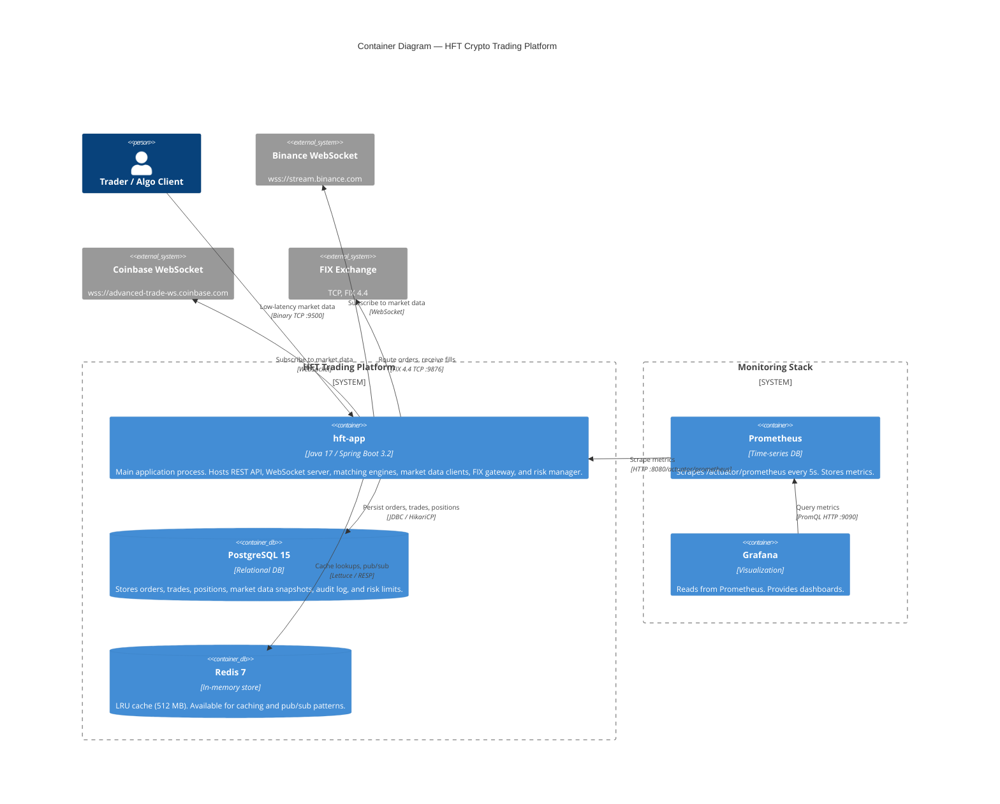
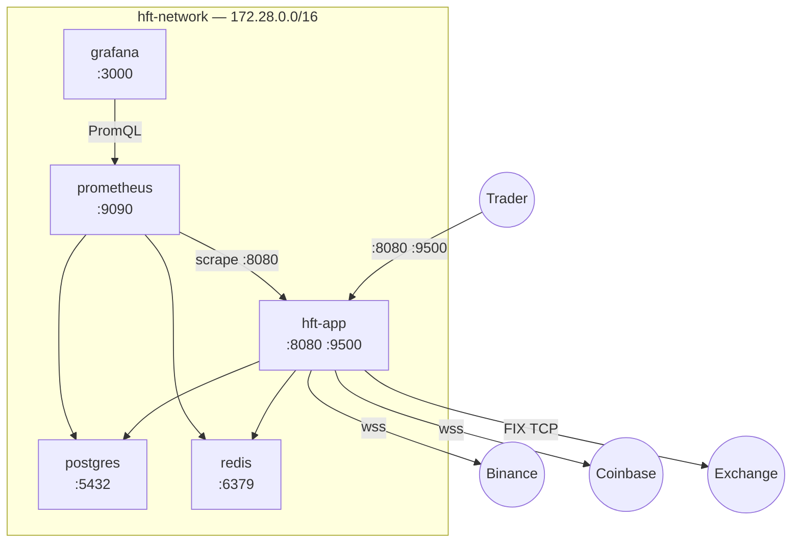

# 02 — Containers (C4 Level 2)

> **C4 Level 2**: Shows the runtime units (processes, databases, external services) and how they communicate.

---

## Container Diagram



---

## Container Details

### hft-app (Main Application Process)

| Property | Value |
|----------|-------|
| Technology | Java 17, Spring Boot 3.2 |
| Port — REST / WebSocket | `8080` |
| Port — TCP Market Data | `9500` |
| Memory | 4 GB reserved / 6 GB limit |
| JVM heap | 2 GB min / 4 GB max (G1GC) |
| Aeron shared memory | `/dev/shm/aeron-hft` (mounted from host) |
| Privileges | `privileged: true`, `SYS_NICE`, `IPC_LOCK` capabilities |

Internal modules hosted inside this single JVM:

```
hft-app (JVM process)
├── REST API (Spring MVC, Tomcat — 200 threads, 10K connections)
├── WebSocket Server (Spring WebSocket)
├── TCP Market Data Server (Netty)
├── OrderService + per-symbol OrderMatchingEngine (LMAX Disruptor)
├── RiskManager (pre-trade checks)
├── Market Data Clients (WebSocket, one per exchange)
├── FIX Gateway (QuickFIX/J, optional)
├── AeronTransport (IPC messaging, optional)
└── Persistence Layer (Spring Data JPA, HikariCP)
```

### PostgreSQL 15

| Property | Value |
|----------|-------|
| Host port | `5433` (→ container `5432`) |
| Database | `hft_trading` |
| Schema managed by | Flyway migrations |
| Memory | 1 GB reserved / 2 GB limit |
| Key tables | `orders`, `trades`, `positions`, `market_data_snapshots`, `audit_log`, `risk_limits` |
| Tuning | shared_buffers=512MB, effective_cache_size=1536MB, wal_buffers=16MB |

### Redis 7

| Property | Value |
|----------|-------|
| Host port | `6380` (→ container `6379`) |
| Max memory | 512 MB |
| Eviction policy | `allkeys-lru` |
| Persistence | AOF enabled (`appendonly yes`) |
| Memory limit | 512 MB reserved / 1 GB limit |

### Prometheus

| Property | Value |
|----------|-------|
| Host port | `9090` |
| Scrape interval — default | 15 s |
| Scrape interval — hft-app | 5 s |
| Storage | Local TSDB (`prometheus_data` volume) |

### Grafana

| Property | Value |
|----------|-------|
| Host port | `3001` (→ container `3000`) |
| Credentials | `admin` / `admin123` |
| Dashboards path | `./monitoring/grafana/dashboards` |
| Datasource | Prometheus (auto-provisioned) |

---

## Network Topology



---

## Startup Dependencies

```
postgres (healthy)
    ↓
redis (healthy)
    ↓
hft-app (starts, runs Flyway migrations)
    ↓
prometheus (starts scraping)
    ↓
grafana (loads dashboards)
```

Health check: `hft-app` exposes `GET /actuator/health`. Prometheus scrapes every 5 seconds after the app is healthy (60 s start period).

---

## Communication Protocols

| From | To | Protocol | Details |
|------|----|----------|---------|
| Trader | hft-app | HTTP/1.1 | REST JSON over TLS (or plain in dev) |
| Trader | hft-app | WebSocket | JSON messages, `ws://host:8080/ws/trading` |
| Trader | hft-app | Binary TCP | Netty server on port 9500, SBE-encoded |
| hft-app | PostgreSQL | JDBC | HikariCP pool, max 20 connections |
| hft-app | Redis | RESP | Lettuce async client |
| hft-app | Binance | WebSocket | `wss://stream.binance.com`, JSON |
| hft-app | Coinbase | WebSocket | `wss://advanced-trade-ws.coinbase.com`, JSON |
| hft-app | FIX Exchange | FIX 4.4 TCP | QuickFIX/J, port 9876 (default) |
| Prometheus | hft-app | HTTP | Scrape `/actuator/prometheus` |
| Grafana | Prometheus | PromQL HTTP | Port 9090 |
| (Internal) | Aeron IPC | Shared Memory | `/dev/shm/aeron-hft`, sub-microsecond |
