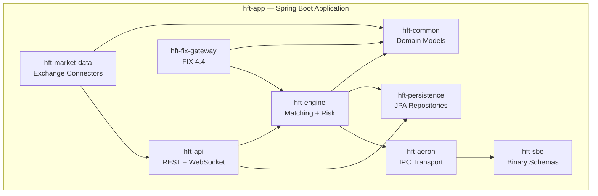
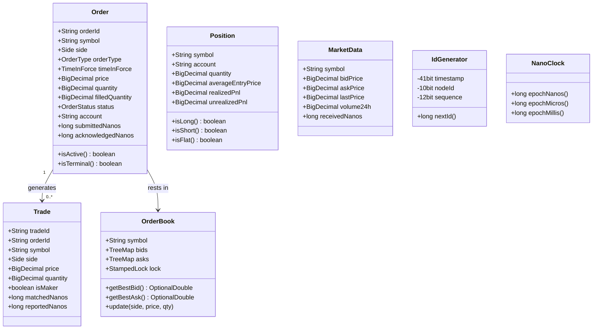
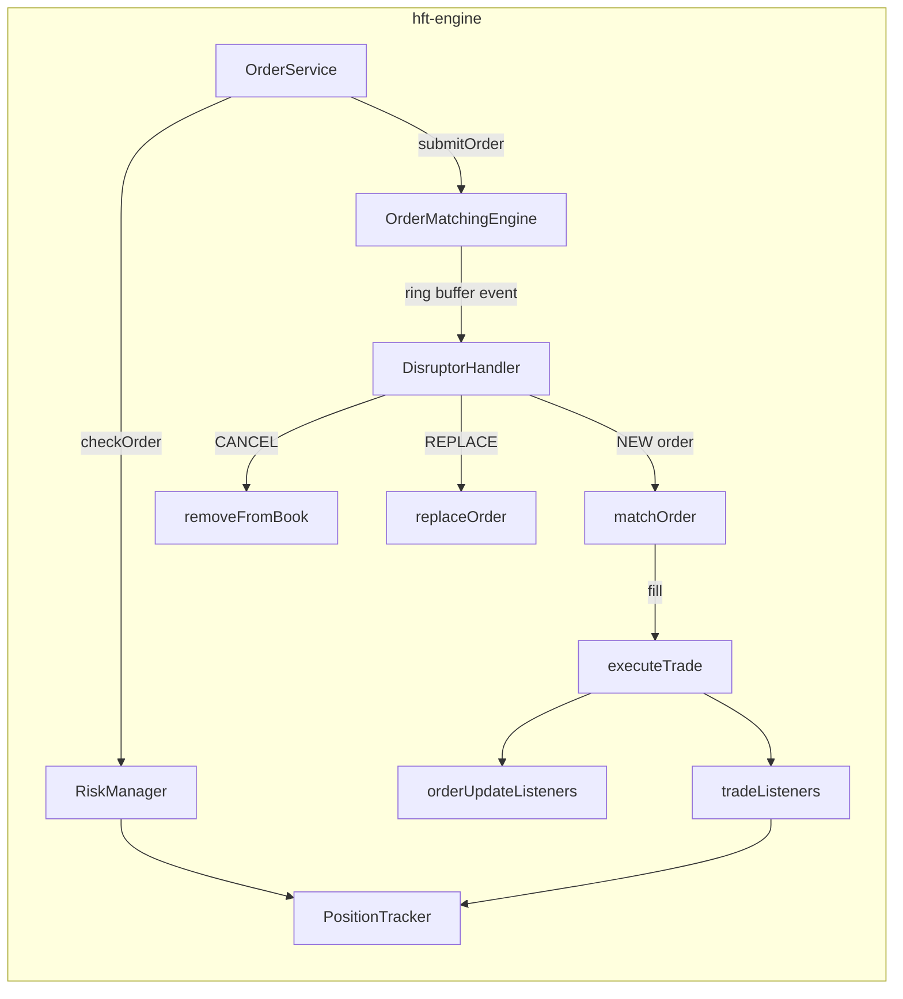
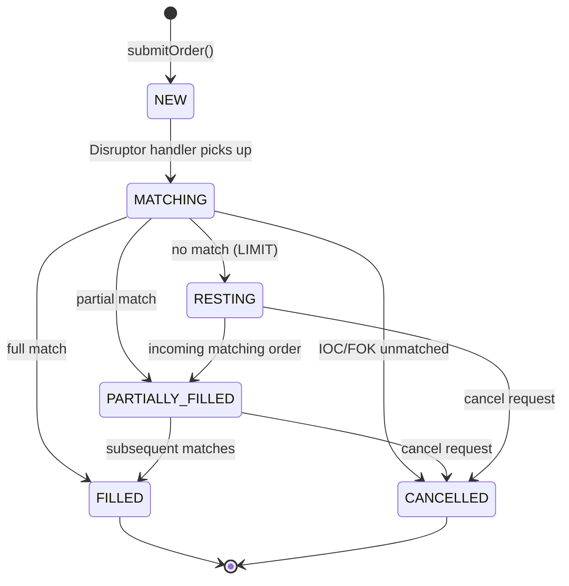
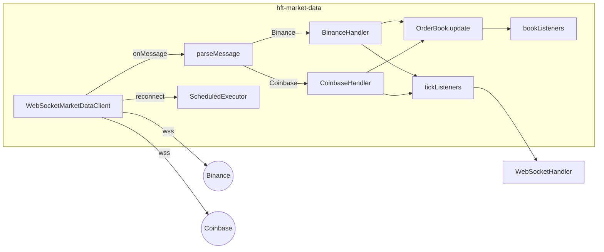
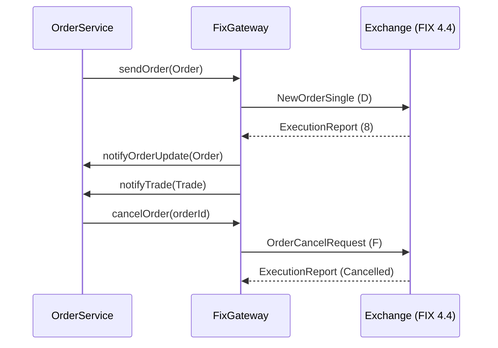
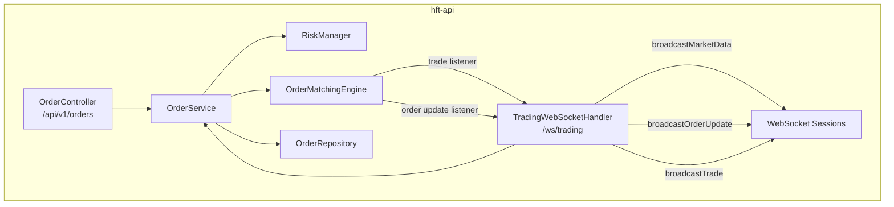
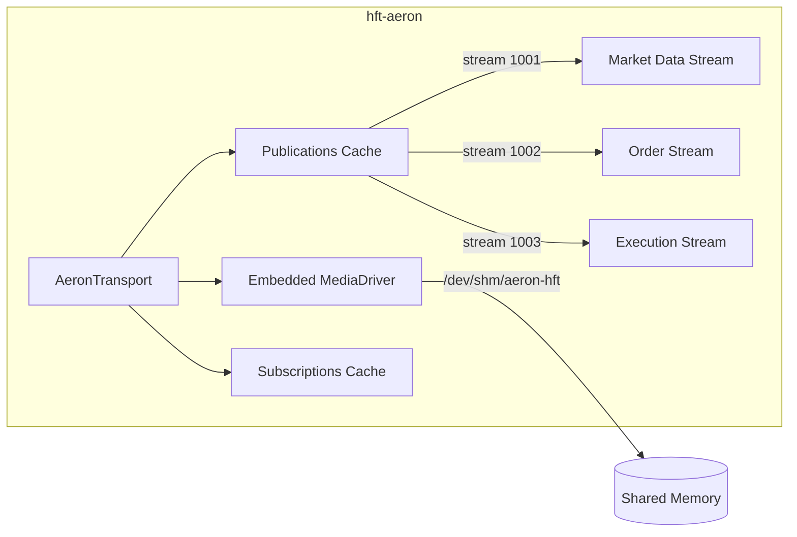

# 03 — Components (C4 Level 3)

> **C4 Level 3**: Decomposes the main application container into its internal modules and components, showing responsibilities and interactions.

---

## Module Overview



---

## hft-common — Domain Models

Shared library. No Spring dependencies. Pure domain objects used by all modules.



**Key design choices:**

- `Order` is immutable — `@With` generates functional update copies
- `OrderBook` uses `StampedLock` for optimistic lock-free reads
- Prices stored as `long` (×10⁸) internally for integer arithmetic; `BigDecimal` on the boundary
- `IdGenerator` implements Snowflake algorithm: 4096 IDs/ms/node

---

## hft-engine — Matching Engine & Risk

The performance-critical core. Runs a dedicated Disruptor thread per symbol.



### OrderMatchingEngine

| Property | Value |
|----------|-------|
| Source | `hft-engine/.../OrderMatchingEngine.java` |
| Concurrency | LMAX Disruptor, ring buffer size 65536 |
| Wait strategy | `BusySpinWaitStrategy` (lowest latency, pins CPU core) |
| Producer type | `MULTI` (multiple threads can submit) |
| Order book structure | `TreeMap<Long, LinkedList<OrderEntry>>` per side |
| Order lookup | `Long2ObjectHashMap<OrderEntry>` for O(1) cancel |
| Matching algorithm | Price-time priority (FIFO within price level) |

**Order Processing States:**



### RiskManager

Pre-trade risk checks executed **synchronously before** order reaches the matching engine. Any failure rejects the order immediately.

| Check # | Check | Config Key |
|---------|-------|-----------|
| 1 | Circuit breaker active | `tradingEnabled` flag |
| 2 | Order rate limit | `maxOrdersPerSecond` |
| 3 | Min order size | `minOrderSize` |
| 4 | Max order size | `maxOrderSize` |
| 5 | Max notional value | `maxOrderNotional` (price × qty) |
| 6 | Max position size | `maxPositionSize` per symbol |
| 7 | Max total exposure | `maxTotalExposure` across all symbols |
| 8 | Daily loss limit | `maxDailyLoss` |
| 9 | Price deviation | `maxPriceDeviation` (10% default) |

---

## hft-market-data — Exchange Connectors



### Binance Channel Mapping

| Stream | Event Type | Output |
|--------|-----------|--------|
| `{symbol}@trade` | Trade tick | `MarketData` (lastPrice, lastQty) |
| `{symbol}@depth@100ms` | Order book diff | `OrderBook.update()` |
| `{symbol}@ticker` | 24h statistics | `MarketData` (OHLCV, volume) |

### Coinbase Channel Mapping

| Channel | Event Type | Output |
|---------|-----------|--------|
| `ticker` | Best bid/ask snapshot | `MarketData` |
| `level2` | Book changes | `OrderBook.update()` |

### Connection Management

- Heartbeat every 30 seconds (exchange-specific ping)
- Auto-reconnect after 5 seconds on disconnect
- Re-subscribes to all configured symbols on reconnect

---

## hft-fix-gateway — FIX 4.4 Protocol Gateway



### FIX Field Mapping

| Domain | FIX Tag | Field |
|--------|---------|-------|
| `Order.side == BUY` | Tag 54 | Side = `1` |
| `Order.side == SELL` | Tag 54 | Side = `2` |
| `OrderType.LIMIT` | Tag 40 | OrdType = `2` |
| `OrderType.MARKET` | Tag 40 | OrdType = `1` |
| `TimeInForce.GTC` | Tag 59 | TimeInForce = `1` |
| `TimeInForce.IOC` | Tag 59 | TimeInForce = `3` |
| `TimeInForce.FOK` | Tag 59 | TimeInForce = `4` |

### Execution Report → Order Status Mapping

| FIX ExecType | FIX OrdStatus | Internal Status |
|-------------|--------------|-----------------|
| `TRADE` | `FILLED` | `FILLED` |
| `PARTIAL_FILL` | `PARTIALLY_FILLED` | `PARTIALLY_FILLED` |
| Any | `CANCELLED` | `CANCELLED` |
| Any | `REJECTED` | `REJECTED` |
| Any | `NEW` | `NEW` |

---

## hft-api — REST API & WebSocket



### REST Endpoints

| Method | Path | Description |
|--------|------|-------------|
| `POST` | `/api/v1/orders` | Submit new order |
| `GET` | `/api/v1/orders/{id}` | Get order by ID |
| `DELETE` | `/api/v1/orders/{id}` | Cancel order |
| `GET` | `/api/v1/orders` | List orders (filter: symbol, status, limit) |
| `GET` | `/api/v1/orders/open` | Get open orders |
| `DELETE` | `/api/v1/orders/cancel-all` | Cancel all orders for symbol |
| `POST` | `/api/v1/orders/cancel-batch` | Batch cancel by order ID list |

### WebSocket Message Protocol

**Client → Server:**

```json
{"type": "subscribe", "channel": "marketdata", "symbol": "BTCUSDT"}
{"type": "subscribe", "channel": "orders", "account": "DEFAULT"}
{"type": "subscribe", "channel": "trades", "account": "DEFAULT"}
{"type": "unsubscribe", "channel": "marketdata", "symbol": "BTCUSDT"}
{"type": "ping"}
```

**Server → Client:**

```json
{"type": "marketdata", "symbol": "BTCUSDT", "data": {...}, "timestamp": 1234567890}
{"type": "order", "account": "DEFAULT", "data": {...}, "timestamp": 1234567890}
{"type": "trade", "account": "DEFAULT", "data": {...}, "timestamp": 1234567890}
{"type": "pong"}
{"type": "error", "message": "Unknown channel"}
```

### OrderService Flow

```
1. Generate orderId via IdGenerator (Snowflake)
2. Build Order domain object from OrderRequest DTO
3. RiskManager.checkOrder() → reject if any check fails
4. orderRepository.save() → persist to PostgreSQL
5. RiskManager.addPendingExposure()
6. getOrCreateMatchingEngine(symbol) → lazy init
7. engine.submitOrder(order) → into Disruptor ring buffer
8. Return OrderResponse with submitLatencyUs
```

---

## hft-aeron — IPC Transport



| Stream ID | Purpose | Direction |
|-----------|---------|-----------|
| 1001 | Market data updates | MarketDataService → consumers |
| 1002 | Order events | API → Engine |
| 1003 | Execution reports | Engine → Gateway/API |

**Channel types:**

- `aeron:ipc` — in-process (zero-copy shared memory)
- `aeron:udp` — cross-process / cross-host UDP multicast

---

## hft-sbe — Binary Message Schemas

SBE (Simple Binary Encoding) defines fixed-width binary message layouts for zero-allocation, zero-copy serialization.

| Message | ID | Direction | Key Fields |
|---------|-----|-----------|-----------|
| `NewOrderSingle` | 1 | API → Engine | symbol, side, ordType, price, qty, timeInForce |
| `CancelOrderRequest` | 2 | API → Engine | orderId, clOrdId |
| `ReplaceOrderRequest` | 3 | API → Engine | orderId, new price, new qty |
| `ExecutionReport` | 4 | Engine → API | orderId, status, execType, cumQty, leavesQty, avgPx |
| `OrderCancelReject` | 5 | Engine → API | orderId, reason |
| `MarketDataSnapshot` | 6 | MarketData → consumers | symbol, bid/ask/last levels |
| `OrderBookUpdate` | 7 | MarketData → consumers | symbol, repeating bid/ask groups |
| `TradeUpdate` | 8 | Engine → consumers | tradeId, orderId, price, qty, isMaker |
| `Heartbeat` | 9 | bidirectional | nodeId, timestamp |
| `PositionUpdate` | 10 | Engine → consumers | symbol, account, quantity, avgPrice, pnl |

**Custom types:**

- `decimal`: `int64` mantissa + `int8` exponent
- `timestamp`: `int64` nanoseconds since epoch
- `varStringEncoding`: variable-length UTF-8 string

---

## hft-persistence — Data Access Layer

```mermaid
graph LR
    subgraph hft-persistence
        OE[OrderEntity<br/>@Entity] --> OR[OrderRepository<br/>JpaRepository]
        TE[TradeEntity<br/>@Entity] --> TR[TradeRepository]
        PE[PositionEntity<br/>@Entity] --> PR[PositionRepository]
        OR -->|JDBC| PG[(PostgreSQL)]
        TR -->|JDBC| PG
        PR -->|JDBC| PG
        FLY[Flyway Migrations] -->|init schema| PG
    end
```

### Repository Capabilities

**OrderRepository:**

- `findById`, `findByClientOrderId`
- `findBySymbol`, `findByAccount`, `findByStatus`
- `findOpenOrders()`, `findOpenOrdersBySymbol()`, `findOpenOrdersByAccount()`
- Paginated: `findByAccountOrderByCreatedAtDesc(Pageable)`
- Bulk updates: `updateStatus()`, `updateFill()`
- Cleanup: `deleteOldOrders(timestamp)` — removes terminated orders older than cutoff

**Performance:**

- HikariCP pool: 5 min idle / 20 max connections
- Batch size: 50 (Hibernate `jdbc.batch_size`)
- Indexed columns on all filter fields
