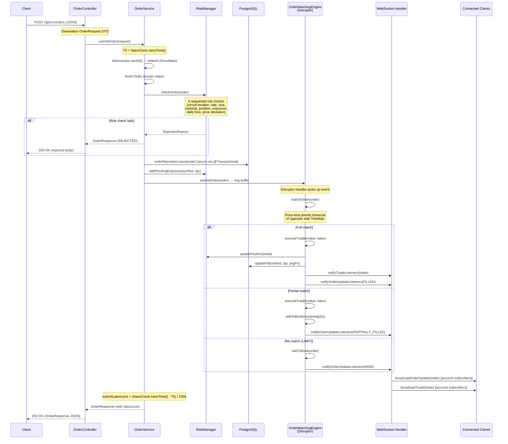
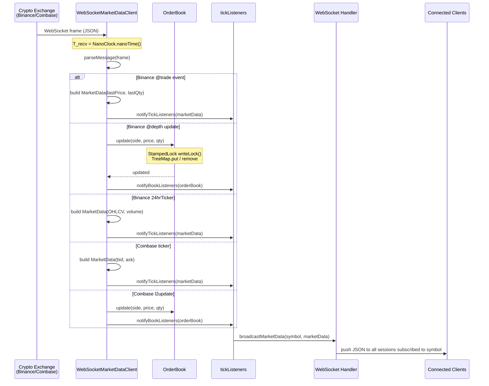
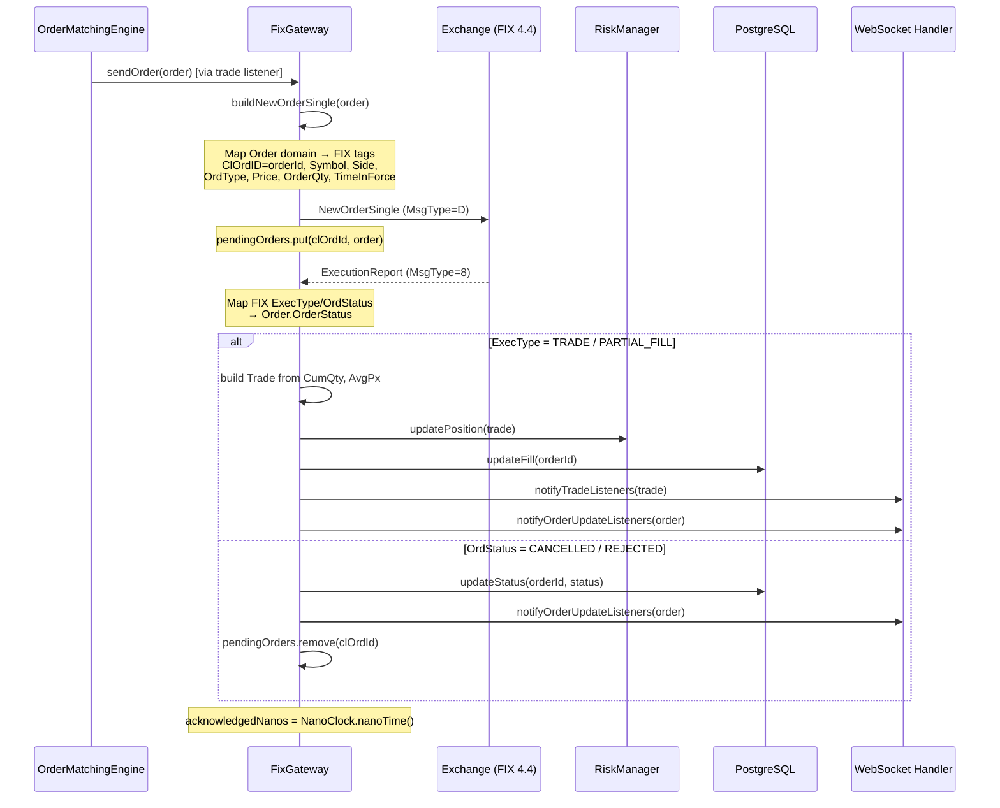
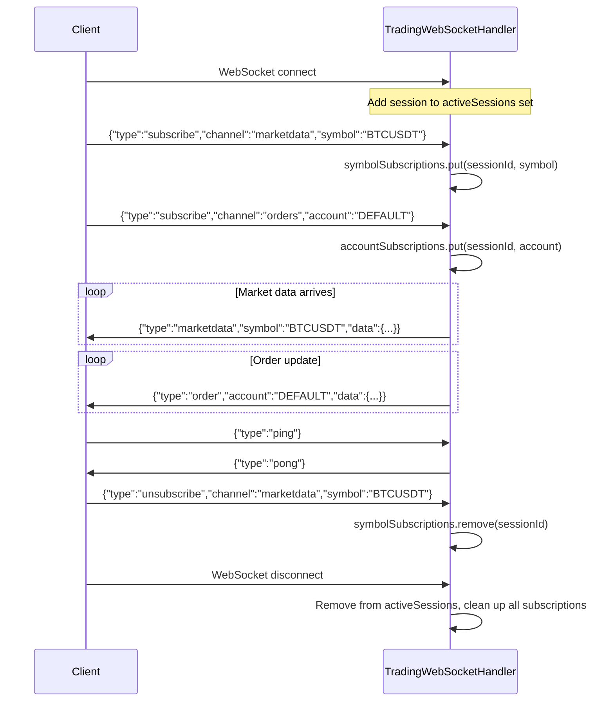
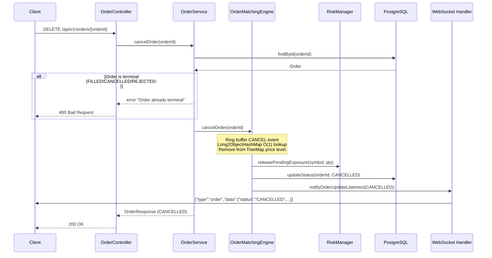

# 04 — Data Flows

Critical end-to-end paths through the system with nanosecond-resolution latency capture points.

---

## Flow 1 — Order Submission (REST → Match → Broadcast)

This is the primary critical path. Every nanosecond matters.



### Latency Capture Points

| Point | Field | Description |
|-------|-------|-------------|
| T0 | `submittedNanos` | Timestamp when OrderService receives the order |
| T1 | `acknowledgedNanos` | FIX gateway acknowledgment (if FIX enabled) |
| T2 | `matchedNanos` | Timestamp when trade is executed in matching engine |
| T3 | `reportedNanos` | Trade report received from exchange (FIX path) |

---

## Flow 2 — Market Data Ingestion & Broadcast



### Market Data Message Format (WebSocket → Client)

```json
{
  "type": "marketdata",
  "symbol": "BTCUSDT",
  "timestamp": 1708000000000000000,
  "data": {
    "bidPrice": 42000.00,
    "bidQuantity": 1.5,
    "askPrice": 42001.00,
    "askQuantity": 0.8,
    "lastPrice": 42000.50,
    "lastQuantity": 0.1,
    "volume24h": 25000.0,
    "high24h": 43000.0,
    "low24h": 41000.0
  }
}
```

---

## Flow 3 — FIX Order Routing (Internal Match → Exchange)

Applies when `hft.fix.enabled=true`. The matching engine can also route orders to an external exchange.



---

## Flow 4 — WebSocket Subscription Lifecycle



---

## Flow 5 — Order Cancellation



---

## Aeron IPC Internal Messaging (Optional Path)

When Aeron is enabled, components communicate via shared memory instead of direct method calls:

```
Market Data Client
    → AeronTransport.publish(stream=1001, SBE MarketDataSnapshot)
    → [/dev/shm/aeron-hft ring buffer]
    → AeronTransport.subscribe(stream=1001)
    → OrderMatchingEngine / API / Risk consumers

OrderService
    → AeronTransport.publish(stream=1002, SBE NewOrderSingle)
    → [/dev/shm/aeron-hft ring buffer]
    → OrderMatchingEngine subscriber

OrderMatchingEngine
    → AeronTransport.publish(stream=1003, SBE ExecutionReport)
    → [/dev/shm/aeron-hft ring buffer]
    → FIX Gateway / API / Risk consumers
```

Latency: **sub-microsecond** for IPC path (shared memory, no syscalls in hot path).
