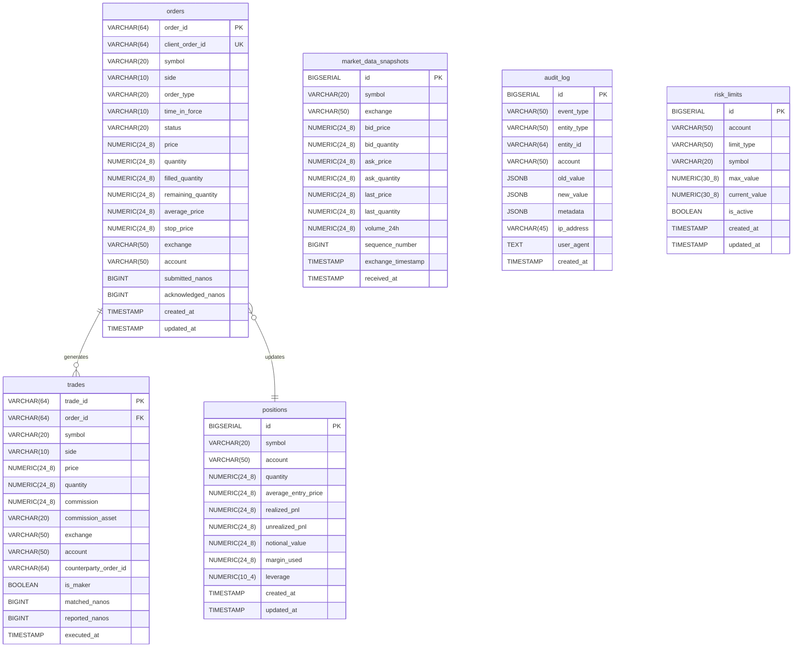
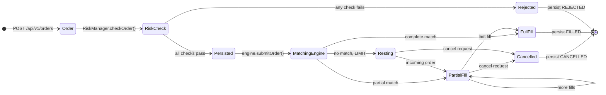

# 05 — Data Architecture

Covers the persistence layer, domain model precision, binary message schemas, and ID generation.

---

## PostgreSQL Schema (Entity Relationship Diagram)



---

## Database Indexes

### orders table

| Index | Columns | Purpose |
|-------|---------|---------|
| `PK` | `order_id` | Primary lookup |
| `UK` | `client_order_id` | Client dedup |
| `IDX` | `symbol` | Filter by market |
| `IDX` | `account` | Filter by account |
| `IDX` | `status` | Filter open/closed |
| `IDX` | `created_at` | Time range queries |
| `COMPOSITE` | `(symbol, status)` | Open orders by symbol |
| `COMPOSITE` | `(account, status)` | Open orders by account |

### trades table

| Index | Columns | Purpose |
|-------|---------|---------|
| `IDX` | `order_id` | Join to orders |
| `IDX` | `symbol` | Filter by market |
| `IDX` | `account` | Filter by account |
| `IDX` | `executed_at` | Time range queries |
| `COMPOSITE` | `(symbol, executed_at)` | OHLCV queries |
| `COMPOSITE` | `(account, executed_at)` | Account P&L queries |

---

## SBE Message Schema

All binary messages use **little-endian** byte order, fixed-width fields, and the `messageHeader` block (templateId, schemaId, version, blockLength).

| ID | Message | Block Length | Key Repeating Group |
|----|---------|-------------|-------------------|
| 1 | `NewOrderSingle` | ~120 bytes | — |
| 2 | `CancelOrderRequest` | ~80 bytes | — |
| 3 | `ReplaceOrderRequest` | ~120 bytes | — |
| 4 | `ExecutionReport` | ~160 bytes | — |
| 5 | `OrderCancelReject` | ~100 bytes | — |
| 6 | `MarketDataSnapshot` | ~60 bytes | Bid/Ask levels (up to 20 each) |
| 7 | `OrderBookUpdate` | ~40 bytes | Bid/Ask changes |
| 8 | `TradeUpdate` | ~120 bytes | — |
| 9 | `Heartbeat` | ~24 bytes | — |
| 10 | `PositionUpdate` | ~100 bytes | — |

### Custom Primitive Types

| SBE Type | Encoding | Java Type | Description |
|----------|----------|-----------|-------------|
| `decimal` | `int64` mantissa + `int8` exponent | `BigDecimal` | Price/quantity with full precision |
| `timestamp` | `int64` | `long` | Nanoseconds since Unix epoch |
| `varStringEncoding` | Length-prefixed UTF-8 | `String` | Symbol, orderId, account |
| `Side` | `uint8` ENUM | `Order.Side` | 1=BUY, 2=SELL |
| `OrdType` | `uint8` ENUM | `Order.OrderType` | 1=MARKET, 2=LIMIT, 3=STOP |
| `OrdStatus` | `uint8` ENUM | `Order.OrderStatus` | 0=NEW, 1=PARTIAL, 2=FILLED… |

---

## Price Precision Model

To avoid floating-point errors in financial calculations, the platform uses **integer arithmetic** internally:

```
External (API/JSON):  42000.50     (BigDecimal, 8 decimal places)
Internal (Engine):    4200050000000  (long, × 10^8)
```

### Why integer arithmetic?

| Problem with floats | Solution |
|--------------------|---------|
| `0.1 + 0.2 ≠ 0.3` in IEEE 754 | Integer comparisons are exact |
| Float comparison unreliable for price equality | `price1 == price2` works on longs |
| Slower BigDecimal operations in hot loop | `long` arithmetic is single CPU instruction |

**Conversion:** `long internalPrice = price.multiply(BigDecimal.valueOf(100_000_000L)).longValue()`

---

## Snowflake ID Generation

Orders, trades, and positions use **Snowflake IDs** — 64-bit integers generated without coordination across nodes.

```
 63        22      12      0
  |         |       |      |
  0 [41-bit ms timestamp] [10-bit node] [12-bit seq]
```

| Segment | Bits | Range | Notes |
|---------|------|-------|-------|
| Sign bit | 1 | Always 0 | Keeps IDs positive |
| Timestamp | 41 | ~69 years from epoch | Milliseconds since custom epoch |
| Node ID | 10 | 0–1023 | Set via `hft.node.id` config |
| Sequence | 12 | 0–4095 | Resets each millisecond |

**Throughput:** 4,096 unique IDs per millisecond per node = **4M IDs/sec** per node.

**Clock drift handling:** If `currentMs < lastMs`, `IdGenerator` waits for `nextMs` (busy-spin up to 1ms).

---

## Redis Data Model

Redis is configured as an **LRU cache** with AOF persistence. Potential usage patterns:

| Key Pattern | Value | TTL | Purpose |
|-------------|-------|-----|---------|
| `order:{orderId}` | JSON string | 1h | Hot order cache |
| `position:{account}:{symbol}` | JSON string | None | Position cache |
| `riskcheck:{account}` | Hash | None | Real-time risk state |
| `marketdata:{symbol}` | Hash | 30s | Last known tick |

> Note: Redis integration is configured but the extent of use depends on active Spring Cache annotations in the service layer.

---

## Domain Model Lifecycle



Each state transition:

1. Updates the in-memory `Order` object (new immutable copy via `@With`)
2. Persists change to PostgreSQL via `orderRepository.updateStatus()` or `updateFill()`
3. Notifies WebSocket listeners
4. Updates `Position` and `RiskManager` state
