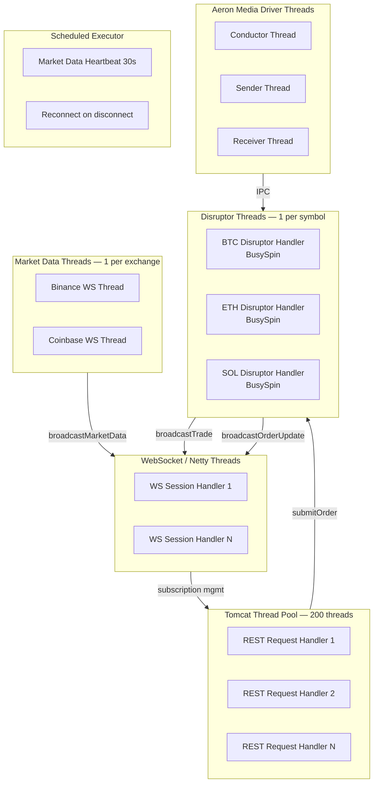

# 06 — Performance Architecture

The entire stack is designed around one constraint: **minimize latency at every layer**. This document explains the threading model, lock-free patterns, memory strategy, and JVM configuration.

---

## Latency Budget

The platform captures timestamps at 4 key points to measure end-to-end trading latency:

```
Client submits order
        │
        ▼ T0: submittedNanos        ← NanoClock.nanoTime() in OrderService
   Risk checks (~1–5 µs)
        │
        ▼
   DB persist (~100–500 µs async)
        │
        ▼
   Ring buffer enqueue (~100 ns)
        │
        ▼
   Disruptor handler (~50–200 ns)
        │
        ▼ T2: matchedNanos           ← NanoClock.nanoTime() in executeTrade()
   Trade created
        │
        ▼ T1: acknowledgedNanos      ← FIX ExecutionReport received
   FIX gateway roundtrip (~1–5 ms)
        │
        ▼ T3: reportedNanos          ← Exchange trade report
```

**Target order-to-match latency (internal):** < 1 µs (via Disruptor + IPC path)
**API latency (REST submit-to-ack):** ~500 µs–2 ms (includes network + DB)

---

## Threading Model



### Thread Responsibilities

| Thread | Count | Role | CPU Profile |
|--------|-------|------|------------|
| Tomcat REST | 200 (max) | HTTP request processing | Blocking I/O |
| WebSocket | Netty event loop | WS session management | Event-driven |
| Disruptor handler | 1 per symbol | Order matching | Busy-spin (pins core) |
| Market data | 1 per exchange | WebSocket ingestion | I/O bound |
| Aeron conductor | 1 | IPC state machine | Spinning |
| Aeron sender | 1 | Message publication | Spinning |
| Aeron receiver | 1 | Message subscription | Spinning |
| Scheduled | 1 | Heartbeat + reconnect | Sleeping |

---

## Lock-Free Design

### Disruptor Ring Buffer

```
Producer threads (Tomcat, WS)
        │
        ▼ sequence.getAndIncrement()
┌───────────────────────────────────────────────────┐
│  [slot 0][slot 1][slot 2]...[slot 65535][slot 0]  │  ← 64KB ring buffer
└───────────────────────────────────────────────────┘
        │
        ▼ barrier.waitFor(sequence)
Consumer thread (1 handler per symbol)
```

- No locks. Producers use CAS on sequence numbers.
- Consumer uses `BusySpinWaitStrategy` — trades CPU for minimum latency.
- Ring buffer size 65536 = power of 2 → modulo via bitwise AND (`& (size-1)`).
- Pre-allocated `OrderEvent` objects in all ring buffer slots → **zero allocation in hot path**.

### StampedLock on OrderBook

```java
// Read path (market data queries)
long stamp = book.lock.tryOptimisticRead();
long bestBid = book.bids.firstKey();          // no lock acquired
if (!book.lock.validate(stamp)) {
    stamp = book.lock.readLock();             // fallback to read lock
    bestBid = book.bids.firstKey();
    book.lock.unlockRead(stamp);
}

// Write path (book updates, matching)
long stamp = book.lock.writeLock();
try { book.bids.put(price, level); }
finally { book.lock.unlockWrite(stamp); }
```

**Why StampedLock over synchronized/ReentrantLock?**

- Optimistic reads avoid lock acquisition entirely in the common case
- Writers still get exclusive access
- No reader-writer starvation issues

### Concurrent Collections

| Collection | Usage | Why |
|-----------|-------|-----|
| `ConcurrentHashMap` | symbol → engine map | Lock-free reads, striped writes |
| `Long2ObjectHashMap` | orderId → OrderEntry | Primitive keys, no boxing, O(1) |
| `CopyOnWriteArraySet` | WebSocket sessions | Consistent snapshot for broadcast |
| `CopyOnWriteArrayList` | Event listeners | Infrequent writes, frequent iteration |
| `AtomicLong` | Sequence numbers, counters | CAS updates, no contention |
| `AtomicBoolean` | Connection status, circuit breaker | Visibility + atomicity |
| `volatile` | Market data fields, P&L | Visibility without CAS overhead |

---

## Memory Strategy

### Off-Heap Allocations

| Component | Technique | Benefit |
|-----------|-----------|---------|
| Aeron messaging | `UnsafeBuffer` (Agrona) | Direct memory, bypasses GC |
| SBE encoding | `DirectBuffer` (read-only view) | Zero-copy deserialization |
| Aeron IPC | Shared memory (`/dev/shm`) | No kernel involvement |
| TCP server (Netty) | `ByteBuffer.allocateDirect()` | Off-heap I/O buffers |

### Allocation Reduction in Hot Path

- **Ring buffer slots pre-allocated**: `OrderEvent` objects exist for all 65536 slots at startup
- **ThreadLocal send buffer**: `ThreadLocal<UnsafeBuffer>` (4KB) per Aeron sender thread
- **Primitive collections**: `Long2ObjectHashMap` stores longs without boxing
- **Price as long**: Avoids `BigDecimal` object creation during matching
- **Immutable @With copies**: Only on boundary (API layer), not inside the matching loop

### GC Configuration

```
-XX:+UseG1GC                    # Region-based, predictable pause times
-XX:MaxGCPauseMillis=10         # Target max 10ms GC pause
-XX:+UseStringDeduplication     # Reduce String heap usage
-XX:+AlwaysPreTouch             # Touch all memory pages at JVM startup
-XX:+DisableExplicitGC          # Prevent System.gc() from forcing GC
-Xms2g -Xmx4g                   # Fixed heap (avoid resize pauses)
```

**Why not ZGC or Shenandoah?**
G1GC with a 10ms target is sufficient for this architecture because:

- Matching engine uses off-heap memory (not subject to GC)
- Aeron/SBE operate on DirectBuffer (off-heap)
- The only GC pressure is from API request handling (REST DTOs)

---

## System Properties for Low Latency

Set in `HftApplication.main()` before Spring context starts:

| Property | Value | Effect |
|----------|-------|--------|
| `java.security.egd` | `file:/dev/./urandom` | Non-blocking entropy source |
| `agrona.disable.bounds.checks` | `true` | Skip UnsafeBuffer bounds checks in hot path |
| `aeron.term.buffer.sparse.file` | `false` | Pre-allocate Aeron term buffers (no lazy mapping) |
| `aeron.pre.touch.mapped.memory` | `true` | Touch all Aeron pages at startup (avoid page faults) |

---

## Linux Kernel Tuning

For production deployment on bare metal or dedicated VMs:

```bash
# Increase network buffer sizes for high-throughput WebSocket
sysctl -w net.core.rmem_max=16777216
sysctl -w net.core.wmem_max=16777216
sysctl -w net.ipv4.tcp_rmem="4096 87380 16777216"
sysctl -w net.ipv4.tcp_wmem="4096 65536 16777216"

# Enable huge pages for Aeron shared memory
sysctl -w vm.nr_hugepages=1024

# Disable CPU frequency scaling (avoid latency spikes)
cpupower frequency-set -g performance

# Pin Disruptor threads to isolated CPU cores
taskset -c 2,3 java -jar hft-app.jar  # Dedicated cores for matching

# Disable transparent huge pages (causes GC pauses)
echo never > /sys/kernel/mm/transparent_hugepage/enabled
```

---

## Idle Strategies (Aeron)

Controls how Aeron threads behave when there is no work to do:

| Strategy | CPU Usage | Latency | Use Case |
|----------|-----------|---------|---------|
| `SPINNING` | 100% | < 1 µs | Production HFT (dedicated cores) |
| `YIELDING` | ~50% | ~1–5 µs | Default (dev/staging) |
| `SLEEPING` | Low | > 100 µs | Background tasks |
| `BACK_OFF` | Adaptive | Adaptive | General purpose |

**Config:**

```yaml
hft:
  aeron:
    idle-strategy: YIELDING  # Change to SPINNING in prod profile
```

---

## Performance Benchmarks (Design Targets)

| Metric | Target | Notes |
|--------|--------|-------|
| Order ring buffer enqueue | < 100 ns | Single CAS on sequence |
| Disruptor handler (no match) | < 500 ns | Book lookup + listener notify |
| Disruptor handler (1 match) | < 1 µs | Match + trade + 2 listener calls |
| Aeron IPC publish | < 200 ns | Shared memory write |
| Market data parse (Binance) | < 5 µs | JSON parse + OrderBook update |
| REST API end-to-end | < 2 ms | Network + DB + matching |
| WebSocket broadcast | < 100 µs | CopyOnWriteArraySet iteration + WS write |
