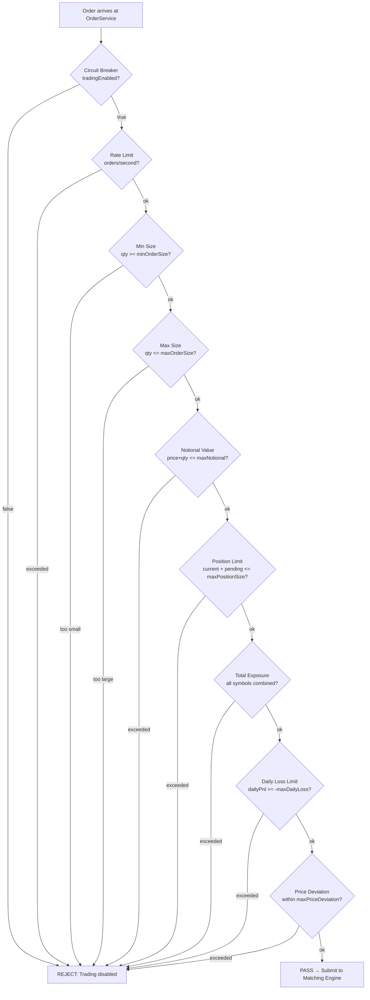

# 07 — Risk Management

The risk management subsystem is the safety layer between client requests and the matching engine. **All risk checks are synchronous and occur before any order touches the matching engine.**

---

## Pre-Trade Risk Check Pipeline

Every order passes through 9 sequential checks. The first failure immediately rejects the order.



---

## Risk Configuration

### Default vs Production Values

| Parameter | Default | Production | Description |
|-----------|---------|-----------|-------------|
| `maxOrderSize` | 1,000 | 1,000 | Max quantity per order |
| `minOrderSize` | 0.001 | 0.001 | Min quantity per order |
| `maxOrderNotional` | 1,000,000 | 1,000,000 | Max price × quantity |
| `maxPositionSize` | 10,000 | 10,000 | Max net position per symbol |
| `maxTotalExposure` | 10,000,000 | 10,000,000 | Max sum of |position| × price |
| `maxDailyLoss` | 100,000 | 100,000 | Max daily loss in USD |
| `maxPriceDeviation` | 10% | 10% | Max deviation from average entry |
| `maxOrdersPerSecond` | 100 | 1,000 | Order rate limit |

### Environment Variable Overrides (Docker)

```yaml
RISK_MAX_ORDER_SIZE: 1000
RISK_MAX_POSITION_SIZE: 10000
```

---

## Check Details

### 1. Circuit Breaker (`tradingEnabled`)

A single `AtomicBoolean` flag. When set to `false`, **all** new orders are rejected immediately.

**Triggers (manual or automated):**

- System operator manually disables via admin endpoint
- Daily loss limit breached (auto-disable)
- Exchange connectivity lost (optional auto-disable)

**Reset:** Must be explicitly re-enabled. Does not auto-reset on restart.

---

### 2. Order Rate Limit

```
tokensAvailable -= 1 per order
tokensAvailable += maxOrdersPerSecond per second (refill)
if tokensAvailable < 0 → REJECT
```

Uses token bucket algorithm. Tracks per-account rate in `AtomicLong` counters.

---

### 3 & 4. Order Size Limits

Simple range check:

```
minOrderSize ≤ order.quantity ≤ maxOrderSize
```

Rejects orders that are too small (dust) or too large (fat-finger protection).

---

### 5. Notional Value Limit

```
if order.price × order.quantity > maxOrderNotional → REJECT
```

For MARKET orders (no price), uses the current best ask/bid from the order book.

---

### 6. Position Limit

```
currentPosition = positionMap.get(symbol)
pendingExposure = pendingMap.get(symbol)
newExposure = currentPosition.quantity + order.quantity (BUY) or - order.quantity (SELL)
if |newExposure| > maxPositionSize → REJECT
```

`pendingExposure` tracks orders that are in the matching engine but not yet filled, preventing a burst of orders from bypassing position limits.

---

### 7. Total Exposure Limit

```
totalExposure = Σ |position.notionalValue| across all symbols
if totalExposure + orderNotional > maxTotalExposure → REJECT
```

Prevents concentration risk across many symbols simultaneously.

---

### 8. Daily Loss Limit

```
if dailyPnl < -maxDailyLoss → REJECT (and auto-disable circuit breaker)
```

`dailyPnl` is a `volatile double` updated after every trade. Resets at midnight (or on restart).

---

### 9. Price Deviation Check

```
avgEntryPrice = position.averageEntryPrice
deviation = |order.price - avgEntryPrice| / avgEntryPrice
if deviation > maxPriceDeviation → REJECT
```

Protects against erroneous orders submitted at prices far from the current position's average entry. Only applies when a position already exists.

---

## Position Management

After a trade executes, `RiskManager.updatePosition()` is called:

### Average Entry Price Calculation

```
New position (no existing):
  avgEntry = trade.price
  quantity = trade.quantity

Adding to position (same side):
  avgEntry = (existingQty × existingAvgPrice + tradeQty × tradePrice)
           / (existingQty + tradeQty)
  quantity += trade.quantity

Reducing position (opposite side):
  realizedPnl += (tradePrice - avgEntryPrice) × tradeQuantity  [for LONG]
  realizedPnl += (avgEntryPrice - tradePrice) × tradeQuantity  [for SHORT]
  quantity -= trade.quantity
  avgEntry unchanged (only realized when closing)
```

### Unrealized P&L

Calculated on demand using the latest market data:

```
unrealizedPnl = (currentMarketPrice - avgEntryPrice) × openQuantity  [LONG]
unrealizedPnl = (avgEntryPrice - currentMarketPrice) × openQuantity  [SHORT]
```

---

## Metrics Tracked by RiskManager

| Metric | Type | Description |
|--------|------|-------------|
| `totalPnl` | `volatile double` | Lifetime P&L across all trades |
| `dailyPnl` | `volatile double` | Today's P&L (resets midnight) |
| `orderCount` | `AtomicLong` | Total orders processed |
| `rejectCount` | `AtomicLong` | Total orders rejected |
| `tradeCount` | `AtomicLong` | Total trades executed |
| `totalVolume` | `volatile double` | Cumulative traded volume |

All metrics are exposed via Micrometer → Prometheus → Grafana.

---

## Risk Architecture Summary

```
                    ┌─────────────────────────────────┐
                    │          RiskManager             │
                    │                                  │
 Order arrives ────►│  1. Circuit breaker             │
                    │  2. Rate limit                  │
                    │  3. Size limits                 │──► REJECT (fast path)
                    │  4. Notional limit              │
                    │  5. Position limit              │
                    │  6. Total exposure              │
                    │  7. Daily loss                  │
                    │  8. Price deviation             │
                    │                                 │
                    │  All pass ─────────────────────►│──► Matching Engine
                    │                                 │
                    │  Position state                 │◄── Trade updates
                    │  Pending exposure               │
                    │  Daily P&L                      │
                    └─────────────────────────────────┘
```

The `RiskManager` is a stateful singleton shared across all matching engine instances. Position state is kept in memory and must be restored from PostgreSQL on startup.
