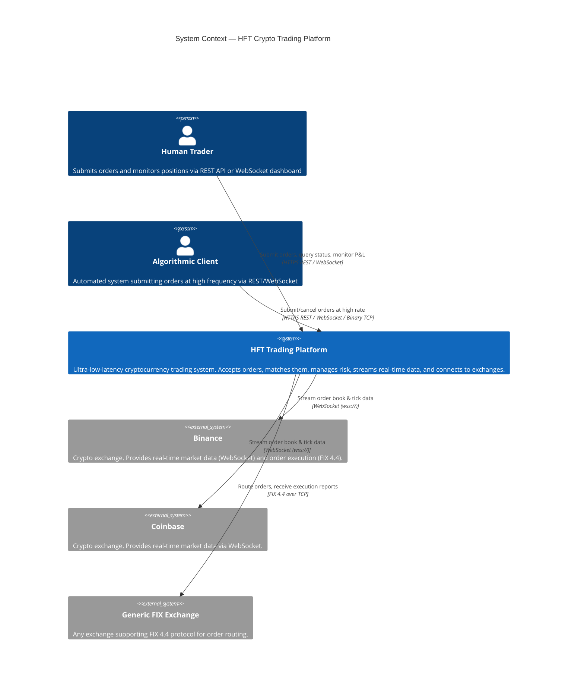

# 01 — System Context (C4 Level 1)

> **C4 Level 1**: The highest-level view. Shows what the system does and who interacts with it, without revealing internal implementation details.

---

## Context Diagram



---

## System Responsibilities

The HFT Trading Platform is responsible for:

| Responsibility | Description |
|----------------|-------------|
| **Order Management** | Accept, validate, persist, and route buy/sell orders for cryptocurrency pairs |
| **Order Matching** | Match orders internally using price-time priority with sub-microsecond latency |
| **Risk Management** | Enforce pre-trade risk controls (size, notional, position, daily loss, rate limits) |
| **Market Data** | Ingest, normalize, and redistribute real-time order book data from multiple exchanges |
| **Exchange Connectivity** | Connect to exchanges via WebSocket (market data) and FIX 4.4 (order routing) |
| **Real-time Push** | Stream order updates, trade confirmations, and market data to connected clients |
| **Persistence** | Store full audit trail of orders, trades, and positions in PostgreSQL |
| **Observability** | Expose nanosecond-resolution latency metrics, Prometheus endpoints, and health checks |

---

## External Actors

### Human Trader
- Interacts via REST API (`POST /api/v1/orders`) or WebSocket (`/ws/trading`)
- Monitors open orders, positions, and P&L
- Typical latency tolerance: milliseconds

### Algorithmic Client
- Automated system hitting REST or WebSocket at high frequency
- May use the binary TCP market data feed (port 9500) for low-latency data
- Typical latency tolerance: microseconds

### Binance
- Primary market data source (configurable)
- Streams: `@trade`, `@depth@100ms`, `@ticker` via `wss://stream.binance.com`
- Supports FIX 4.4 for order routing (configurable)

### Coinbase
- Secondary market data source (configurable)
- Streams: `ticker`, `level2` channels via Coinbase Advanced Trade WebSocket

### Generic FIX Exchange
- Any FIX 4.4-compatible counterparty
- Used for external order routing and receiving ExecutionReport messages

---

## System Boundaries

```
┌─────────────────────────────────────────────┐
│              INSIDE THE PLATFORM            │
│                                             │
│  Order Matching  │  Risk Management         │
│  Market Data     │  Position Tracking       │
│  REST / WS API   │  Persistence             │
│  FIX Gateway     │  Observability           │
└─────────────────────────────────────────────┘
            │              │
    External actors    External exchanges
    (traders, algos)   (Binance, Coinbase, FIX)
```

Everything inside the box runs in a single Spring Boot JVM process (with optional out-of-process Aeron media driver in shared memory). External exchanges and clients are outside the trust boundary.

---

## Key Design Principles

1. **Latency first**: Every architectural decision is evaluated against its impact on order processing latency.
2. **Risk always on**: Pre-trade risk checks are synchronous and cannot be bypassed.
3. **Immutability**: Domain objects (Order, Trade, Position) are immutable — state transitions produce new objects.
4. **Event-driven internally**: Internal components communicate via listeners/consumers, not direct method coupling.
5. **Audit trail**: Every order and trade is persisted with nanosecond timestamps.
