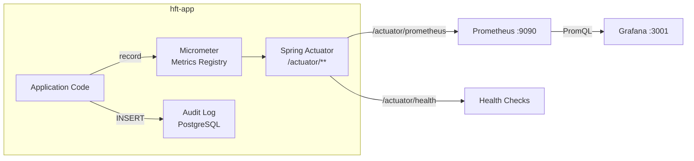

# 08 — Observability

The platform exposes multiple observability surfaces: Prometheus metrics, Grafana dashboards, Spring Actuator endpoints, and a PostgreSQL audit log.

---

## Observability Architecture



---

## Spring Actuator Endpoints

All endpoints are publicly accessible (no auth in current config):

| Endpoint | Method | Description |
|----------|--------|-------------|
| `/actuator/health` | GET | Application health summary |
| `/actuator/health/**` | GET | Detailed component health |
| `/actuator/prometheus` | GET | Prometheus-format metrics |
| `/actuator/metrics` | GET | All available metric names |
| `/actuator/metrics/{name}` | GET | Specific metric value |
| `/actuator/info` | GET | Application build info |
| `/actuator/env` | GET | Environment properties |
| `/actuator/loggers` | GET/POST | Log level management |
| `/actuator/threaddump` | GET | JVM thread dump |
| `/actuator/heapdump` | GET | JVM heap dump |

### Health Check Configuration

```yaml
management:
  endpoint:
    health:
      show-details: always  # Exposes DB, Redis, disk health details
  endpoints:
    web:
      exposure:
        include: health,prometheus,metrics,info
```

### Health Indicators Available

| Indicator | Checks |
|-----------|--------|
| `db` | PostgreSQL JDBC connection via HikariCP |
| `redis` | Redis PING via Lettuce |
| `diskSpace` | Available disk space |
| `ping` | Always UP (self) |

---

## Prometheus Scrape Configuration

```yaml
# monitoring/prometheus.yml
global:
  scrape_interval: 15s
  evaluation_interval: 15s

scrape_configs:
  - job_name: 'hft-app'
    scrape_interval: 5s          # More frequent for trading metrics
    metrics_path: '/actuator/prometheus'
    static_configs:
      - targets: ['hft-app:8080']

  - job_name: 'postgres'
    static_configs:
      - targets: ['postgres:5432']

  - job_name: 'redis'
    static_configs:
      - targets: ['redis:6379']
```

---

## Key Metrics

### Trading Metrics (Custom)

| Metric | Type | Description |
|--------|------|-------------|
| `hft.orders.submitted` | Counter | Total orders submitted |
| `hft.orders.rejected` | Counter | Total orders rejected by risk |
| `hft.orders.filled` | Counter | Total orders fully filled |
| `hft.trades.executed` | Counter | Total trades executed |
| `hft.latency.submit.us` | Histogram | Order submit latency in µs |
| `hft.latency.match.us` | Histogram | Order match latency in µs |
| `hft.latency.ack.us` | Histogram | FIX ack latency in µs |
| `hft.position.pnl` | Gauge | Current P&L by symbol/account |
| `hft.position.size` | Gauge | Current position size |
| `hft.risk.daily.pnl` | Gauge | Today's P&L |
| `hft.risk.rejected.total` | Counter | Risk rejection count |
| `hft.orderbook.depth` | Gauge | Order book depth by symbol/side |
| `hft.marketdata.received` | Counter | Market data ticks received |
| `hft.fix.connected` | Gauge | FIX gateway connection status (0/1) |

### JVM Metrics (via Micrometer)

| Metric | Description |
|--------|-------------|
| `jvm.memory.used` | Heap and non-heap usage |
| `jvm.gc.pause` | GC pause durations (G1GC) |
| `jvm.threads.live` | Active thread count |
| `jvm.threads.peak` | Peak thread count |
| `jvm.buffer.memory.used` | Direct buffer usage (Aeron, Netty) |
| `process.cpu.usage` | Process CPU % |
| `system.cpu.usage` | System CPU % |

### HTTP Metrics (via Micrometer)

| Metric | Description |
|--------|-------------|
| `http.server.requests` | Request count + duration by endpoint |
| `http.server.requests.active` | Currently active requests |

### Database Metrics (HikariCP)

| Metric | Description |
|--------|-------------|
| `hikaricp.connections.active` | Active DB connections |
| `hikaricp.connections.idle` | Idle DB connections |
| `hikaricp.connections.pending` | Threads waiting for connection |
| `hikaricp.connections.timeout.total` | Connection timeout count |

---

## Grafana Dashboards

Dashboards are auto-provisioned from `./monitoring/grafana/dashboards/`.

### Recommended Dashboard Panels

**Trading Overview:**
- Order submission rate (orders/sec)
- Trade execution rate (trades/sec)
- Risk rejection rate
- Submit latency histogram (p50, p95, p99)
- Match latency histogram (p50, p95, p99)

**Position Monitor:**
- P&L by symbol (time series)
- Daily P&L gauge
- Open position size by symbol

**System Health:**
- JVM heap usage
- GC pause duration
- Thread count
- DB connection pool status
- CPU usage

**Market Data:**
- Ticks received per second by symbol
- WebSocket session count
- Market data latency

### Access

| Service | URL | Credentials |
|---------|-----|-------------|
| Grafana | `http://localhost:3001` | `admin` / `admin123` |
| Prometheus | `http://localhost:9090` | No auth |
| Actuator | `http://localhost:8080/actuator` | No auth |

---

## Audit Log

Stored in the `audit_log` PostgreSQL table. Every significant state change is recorded.

### Schema

```sql
CREATE TABLE audit_log (
    id           BIGSERIAL PRIMARY KEY,
    event_type   VARCHAR(50) NOT NULL,    -- ORDER_SUBMITTED, ORDER_FILLED, etc.
    entity_type  VARCHAR(50) NOT NULL,    -- ORDER, TRADE, POSITION, RISK_LIMIT
    entity_id    VARCHAR(64) NOT NULL,    -- orderId, tradeId, etc.
    account      VARCHAR(50),
    old_value    JSONB,                   -- Previous state snapshot
    new_value    JSONB,                   -- New state snapshot
    metadata     JSONB,                   -- Additional context (IP, latency, etc.)
    ip_address   VARCHAR(45),
    user_agent   TEXT,
    created_at   TIMESTAMP DEFAULT NOW()
);
```

### Event Types

| Event Type | Trigger |
|-----------|---------|
| `ORDER_SUBMITTED` | New order accepted by OrderService |
| `ORDER_REJECTED` | Order rejected by RiskManager |
| `ORDER_FILLED` | Order fully executed |
| `ORDER_PARTIALLY_FILLED` | Order partially executed |
| `ORDER_CANCELLED` | Order cancelled by user |
| `TRADE_EXECUTED` | Trade record created |
| `POSITION_UPDATED` | Position changed after trade |
| `RISK_LIMIT_BREACHED` | Risk check triggered |
| `CIRCUIT_BREAKER_TRIGGERED` | Daily loss limit hit |
| `FIX_CONNECTED` | FIX gateway connected |
| `FIX_DISCONNECTED` | FIX gateway disconnected |

### Retention

The `deleteOldOrders(timestamp)` repository method cleans up old terminated orders. A similar TTL strategy should be applied to `audit_log` for high-volume deployments.

---

## Slow Query Monitoring

PostgreSQL is configured to log slow queries:

```
log_min_duration_statement = 100  -- Log queries > 100ms
```

Slow query logs appear in the PostgreSQL container logs and should be monitored in Grafana via the Loki or PostgreSQL datasource.
