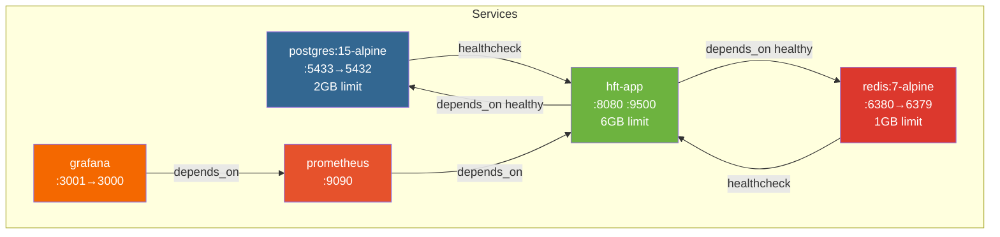

# 09 — Deployment Architecture

---

## Docker Compose Topology



---

## Service Resource Limits

| Service | Memory Reserved | Memory Limit | CPU Notes |
|---------|----------------|-------------|-----------|
| postgres | 1 GB | 2 GB | — |
| redis | 512 MB | 1 GB | — |
| hft-app | 4 GB | 6 GB | Privileged, SYS_NICE, IPC_LOCK |
| prometheus | — | — | Minimal |
| grafana | — | — | Minimal |

---

## hft-app Container Configuration

### Key Capabilities

| Capability | Purpose |
|-----------|---------|
| `privileged: true` | Required for Aeron shared memory, CPU affinity |
| `SYS_NICE` | Set real-time scheduling priority for Disruptor threads |
| `IPC_LOCK` | Lock memory pages for Aeron (prevent swapping) |
| `memlock: -1` | Unlimited memory locking |
| `nofile: 65536` | Increase file descriptor limit (many WebSocket connections) |

### Volume Mounts

| Host Path | Container Path | Purpose |
|-----------|--------------|---------|
| `/dev/shm` | `/dev/shm` | Aeron shared memory (`/dev/shm/aeron-hft`) |
| `./data` | `/data` | Application data files |
| `./logs` | `/logs` | Application log output |

### Environment Variables Reference

| Variable | Default | Description |
|----------|---------|-------------|
| `SPRING_PROFILES_ACTIVE` | `prod` | Spring profile (dev/prod) |
| `DB_HOST` | `postgres` | PostgreSQL hostname |
| `DB_PORT` | `5432` | PostgreSQL port |
| `DB_NAME` | `hft_trading` | Database name |
| `DB_USERNAME` | `hft_user` | DB user |
| `DB_PASSWORD` | `hft_password` | DB password |
| `REDIS_HOST` | `redis` | Redis hostname |
| `REDIS_PORT` | `6379` | Redis port |
| `NODE_ID` | `1` | Snowflake ID node ID (0–1023) |
| `AERON_DIR` | `/dev/shm/aeron-hft` | Aeron media driver directory |
| `MARKET_DATA_EXCHANGE` | `BINANCE` | Primary exchange for market data |
| `MARKET_DATA_SYMBOLS` | `BTCUSDT,...` | Comma-separated symbol list |
| `MARKET_DATA_TCP_PORT` | `9500` | TCP market data server port |
| `RISK_MAX_ORDER_SIZE` | `1000` | Maximum order quantity |
| `RISK_MAX_POSITION_SIZE` | `10000` | Maximum position per symbol |
| `FIX_ENABLED` | `false` | Enable FIX gateway |
| `JAVA_OPTS` | See below | JVM options |

---

## JVM Launch Options

```bash
JAVA_OPTS="-server \
  -XX:+UseG1GC \
  -XX:MaxGCPauseMillis=10 \
  -XX:+UseStringDeduplication \
  -XX:+AlwaysPreTouch \
  -XX:+DisableExplicitGC \
  -Xms2g \
  -Xmx4g"
```

> For maximum performance with dedicated cores, add:
> ```
> -XX:+UseNUMA
> -XX:+UseLargePages
> --add-opens java.base/sun.nio.ch=ALL-UNNAMED   # Netty
> --add-opens java.base/java.lang=ALL-UNNAMED    # Aeron
> ```

---

## Docker Multi-Stage Build

```dockerfile
# Stage 1: Build
FROM maven:3.9-eclipse-temurin-17 AS builder
WORKDIR /app
COPY pom.xml .
RUN mvn dependency:go-offline -B        # Cache dependencies
COPY . .
RUN mvn clean package -DskipTests -B

# Stage 2: Runtime
FROM eclipse-temurin:17-jre-alpine
RUN addgroup -S hft && adduser -S hft -G hft
WORKDIR /app
COPY --from=builder /app/hft-app/target/hft-app-*.jar app.jar
USER hft
EXPOSE 8080 9500
ENTRYPOINT ["java", "${JAVA_OPTS}", "-jar", "app.jar"]
```

**Layered JAR extraction** is used by Spring Boot to split the JAR into layers (dependencies, spring-boot-loader, snapshot-dependencies, application) for efficient Docker layer caching.

---

## Startup Sequence

```
T+0s    Docker Compose starts all services

T+0s    postgres: Start PostgreSQL
T+5s    postgres: HEALTHCHECK (pg_isready) → retries every 10s

T+0s    redis: Start Redis with AOF
T+3s    redis: HEALTHCHECK (redis-cli ping) → retries every 10s

T+10s   hft-app: postgres + redis healthy, JVM starts
T+10s   hft-app: HftApplication.main() → sets system properties
T+10s   hft-app: Spring context initializes
T+15s   hft-app: Flyway migrations run (schema creation / validation)
T+20s   hft-app: Aeron MediaDriver starts (if enabled)
T+20s   hft-app: Tomcat starts on :8080
T+20s   hft-app: Netty TCP server starts on :9500
T+22s   hft-app: Market data WebSocket clients connect to Binance/Coinbase
T+25s   hft-app: FIX gateway connects (if enabled)
T+60s   hft-app: HEALTHCHECK passes (first check after 60s start period)

T+65s   prometheus: Starts scraping hft-app:8080/actuator/prometheus
T+70s   grafana: Starts with Prometheus datasource + dashboards
```

---

## Network Configuration

```yaml
networks:
  hft-network:
    driver: bridge
    ipam:
      config:
        - subnet: 172.28.0.0/16
```

All containers communicate via the `hft-network` bridge network. Service names (`postgres`, `redis`, `hft-app`) resolve via Docker DNS.

---

## Exposed Ports Summary

| Service | Host Port | Container Port | Protocol |
|---------|-----------|---------------|---------|
| hft-app REST/WS | `8080` | `8080` | HTTP/WS |
| hft-app TCP Market Data | `9500` | `9500` | Binary TCP |
| postgres | `5433` | `5432` | PostgreSQL |
| redis | `6380` | `6379` | RESP |
| prometheus | `9090` | `9090` | HTTP |
| grafana | `3001` | `3000` | HTTP |

---

## Production Checklist

- [ ] Change default passwords (`DB_PASSWORD`, Grafana `admin123`)
- [ ] Enable TLS/HTTPS on port 8080 (reverse proxy or Spring SSL)
- [ ] Add authentication to REST API and WebSocket endpoints
- [ ] Set `NODE_ID` uniquely for each deployed instance
- [ ] Configure `MARKET_DATA_EXCHANGE` and `MARKET_DATA_SYMBOLS` for target markets
- [ ] Set `FIX_ENABLED=true` and configure FIX session parameters for exchange connectivity
- [ ] Switch `hft.aeron.idle-strategy` to `SPINNING` and pin Disruptor threads to isolated CPU cores
- [ ] Apply Linux kernel tuning (hugepages, network buffers, CPU governor)
- [ ] Set up log aggregation (ELK, Loki) for centralized log analysis
- [ ] Configure Prometheus alerting rules for circuit breaker, latency spikes, and connectivity loss
- [ ] Set up PostgreSQL backup/recovery procedure
- [ ] Test failover and graceful shutdown under load

---

## Quick Start Commands

```bash
# Build and start all services
docker-compose up -d

# View application logs
docker-compose logs -f hft-app

# Check application health
curl http://localhost:8080/actuator/health

# Submit a test order
curl -X POST http://localhost:8080/api/v1/orders \
  -H "Content-Type: application/json" \
  -d '{
    "symbol": "BTCUSDT",
    "side": "BUY",
    "orderType": "LIMIT",
    "price": 42000.00,
    "quantity": 0.1,
    "timeInForce": "GTC"
  }'

# Open Grafana
open http://localhost:3001   # admin / admin123

# Stop all services
docker-compose down

# Stop and remove volumes (full reset)
docker-compose down -v
```
